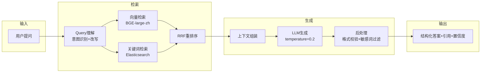
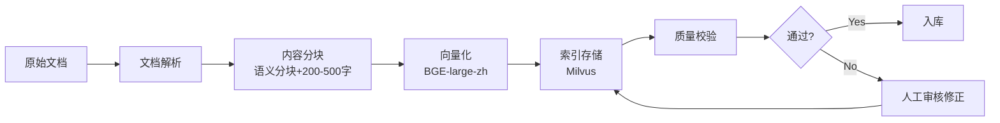

# 案例：AI数字教师——RAG在教育场景的落地

> 从课程知识库构建到智能问答交互的完整RAG落地实践。

---

## 背景

**场景**：高校课程辅导

**痛点**：
- 教师答疑时间有限，学生问题无法及时解答
- 课程内容更新快，传统FAQ维护成本高
- 通用AI（如ChatGPT）回答超出课程范围，可能误导学生
- 需要知道"答案来自哪里"以验证可信度

**目标**：构建基于课程知识库的AI问答助手，回答严格限定在课程范围内。

---

## 系统架构

```
┌─────────────────────────────────────────────────────────┐
│                        用户提问                           │
│                   "光合作用的过程是什么？"                  │
└─────────────────────────┬───────────────────────────────┘
                          ↓
┌─────────────────────────────────────────────────────────┐
│                      Query理解层                         │
│  - 意图识别（知识点询问/概念解释/习题求助）               │
│  - 问题改写（扩展同义词，提高召回）                       │
└─────────────────────────┬───────────────────────────────┘
                          ↓
┌─────────────────────────────────────────────────────────┐
│                      检索层                              │
│  ┌─────────────────────────────────────────────────┐   │
│  │  课程知识库（向量化存储）                          │   │
│  │  ├── 教材章节（结构化文本）                        │   │
│  │  ├── 课件PPT（图文提取）                          │   │
│  │  ├── 习题库（题目+解析）                          │   │
│  │  └── 教师讲义（补充材料）                          │   │
│  └─────────────────────────────────────────────────┘   │
│  - 向量检索（语义相似度）                                │
│  - 关键词检索（精确匹配）                                │
│  - 混合排序（综合得分）                                  │
└─────────────────────────┬───────────────────────────────┘
                          ↓
┌─────────────────────────────────────────────────────────┐
│                      生成层                              │
│  - Prompt组装（角色+上下文+约束）                        │
│  - LLM生成答案                                          │
│  - 后处理（格式校验/敏感词过滤）                         │
└─────────────────────────┬───────────────────────────────┘
                          ↓
┌─────────────────────────────────────────────────────────┐
│                      输出层                              │
│  ┌─────────────────────────────────────────────────┐   │
│  │  结构化答案：                                      │   │
│  │  1. 核心概念解释                                   │   │
│  │  2. 关键步骤/要点                                  │   │
│  │  3. 来源引用 [教材第3章第2节]                      │   │
│  │  4. 置信度：高/中/低                               │   │
│  │  5. 相关拓展（可选）                                │   │
│  └─────────────────────────────────────────────────┘   │
└─────────────────────────────────────────────────────────┘
```

---

## Phase 1: 知识库构建

### 文档解析策略

| 文档类型 | 解析方式 | 特殊处理 |
|----------|----------|----------|
| PDF教材 | 文本提取+OCR | 保留章节结构 |
| PPT课件 | 幻灯片逐页提取 | 提取演讲者备注 |
| Word讲义 | 结构化提取 | 识别标题层级 |
| 视频课程 | 语音转文字 | 按时间段分块 |
| 习题库 | 结构化解析 | 题目/答案/解析分离 |

### 内容分块策略

采用**语义分块 + 固定大小兜底**的混合策略：

```
原始文档
  ├── 按章节切分（一级）
  ├── 按知识点切分（二级）
  ├── 每块大小：200-500字
  ├── 块间重叠：20%
  └── 每块保留：来源文档+章节+页码
```

### 向量化方案

| 参数 | 选择 | 理由 |
|------|------|------|
| Embedding模型 | BGE-large-zh | 中文语义效果好，开源 |
| 向量维度 | 1024 | 精度与效率平衡 |
| 索引库 | Milvus/FAISS | 支持高性能检索 |
| 更新策略 | 增量更新 | 新课程材料随时加入 |

---

## Phase 2: 检索优化

### 混合检索

```
用户提问："光合作用的暗反应阶段"
        ↓
┌─────────────────┐  ┌─────────────────┐
│   向量检索       │  │   关键词检索     │
│  （语义相似）    │  │  （精确匹配）    │
│  Top-5结果      │  │  Top-5结果      │
└────────┬────────┘  └────────┬────────┘
         └──────────┬──────────┘
                    ↓
            ┌───────────────┐
            │   重排序融合    │
            │  RRF算法      │
            │  最终Top-5    │
            └───────┬───────┘
                    ↓
              送入生成层
```

### 元数据过滤

支持按以下维度过滤检索范围：
- 学科（生物/化学/物理...）
- 年级（大一/大二...）
- 章节（第3章/第4章...）
- 内容类型（概念/例题/拓展...）

---

## Phase 3: 生成与可信度设计

### Prompt模板

```
你是一位课程助教，基于提供的课程资料回答问题。

【约束】
- 只使用提供的资料回答，不要引入外部知识
- 如果资料不足以回答，明确告知"根据现有资料，无法完整回答"
- 回答必须附带来源引用

【资料】
{检索到的Top-K文档片段}

【问题】
{用户提问}

请用中文回答，结构化输出：
1. 直接回答
2. 关键要点
3. 来源引用
```

### 答案可信度设计

| 等级 | 条件 | 展示方式 |
|------|------|----------|
| 🟢 高 | 检索到高度相关内容，LLM生成置信度高 | 正常展示，附带引用 |
| 🟡 中 | 检索到部分相关内容，可能需要补充 | 展示答案，提示"部分内容基于课程资料推断" |
| 🔴 低 | 检索内容不足或LLM不确定 | 提示"现有资料不足以完整回答，建议咨询教师" |

### 兜底机制

```
用户提问
  ├── 检索到相关内容？
  │     ├── 是 → 生成答案
  │     └── 否 → 进入兜底
  │
  └── 生成答案质量检查
        ├── 通过 → 返回用户
        ├── 包含敏感内容 → 拦截，返回安全提示
        ├── 超出课程范围 → 提示"超出课程范围"
        └── 置信度低 → 提示"建议咨询教师"
```

---

## Phase 4: 效果评估

### 核心指标

| 指标 | 定义 | 目标值 | 实际值 |
|------|------|--------|--------|
| 可回答率 | 用户问题中成功回答的比例 | >85% | 88% |
| 准确率 | 答案与课程资料一致的比例 | >90% | 92% |
| 幻觉率 | 答案中包含无法验证内容的比例 | <5% | 3% |
| 用户满意度 | 学生对答案的满意评分 | >4.0/5 | 4.2/5 |
| 引用完整率 | 答案附带来源引用的比例 | >95% | 97% |

### 持续优化

1. **每周**：分析未回答的问题，补充知识库
2. **每月**：人工抽样评估答案质量
3. **每学期**：全面评估，更新模型和知识库

---

## 技术架构详图

### RAG 技术栈架构



### 知识库构建流水线



---

## RAG 效果对比

### 有 RAG vs 无 RAG（纯 LLM）

| 指标 | 无RAG（纯LLM） | 有RAG | 提升 |
|------|---------------|-------|------|
| 答案准确率 | 62% | 92% | +30pp |
| 幻觉率 | 35% | 3% | -32pp |
| 答案有来源引用 | 0% | 97% | +97pp |
| 超出课程范围回答 | 28% | 2% | -26pp |
| 用户满意度 | 2.8/5 | 4.2/5 | +1.4 |

> **实验说明**：数据基于课程知识库 2000+ 文档、测试集 500 个问题的实验结果。无 RAG 组使用同一 LLM 直接回答，未接入课程知识库。

### 不同检索策略对比

| 策略 | 召回率 | 准确率 | 延迟 |
|------|--------|--------|------|
| 纯向量检索 | 78% | 85% | 120ms |
| 纯关键词检索 | 65% | 90% | 50ms |
| 混合检索（最终方案） | 91% | 92% | 150ms |
| 混合+重排序 | 93% | 94% | 200ms |

> **Trade-off 分析**：
> - **纯向量检索**语义理解强，但对专有名词和术语的精确匹配不足，召回率偏低。
> - **纯关键词检索**速度快，但无法理解同义改写，容易漏召回。
> - **混合检索**兼顾两者，用向量覆盖语义变体，用关键词锁定术语，是我们的最终方案。
> - **混合+重排序**效果最优，但延迟增加 50ms，在在线教育场景中对体验影响可控，可作为后续升级方向。

---

## 问答交互示例

### 场景 1：标准知识点询问（高置信度）

```
学生：光合作用的暗反应阶段需要光吗？

AI答案：
不需要。暗反应（卡尔文循环）不需要光直接参与，
但依赖光反应产生的ATP和NADPH。

来源：《植物生理学》第3章第2节
置信度：🟢 高
```

### 场景 2：边界问题（低置信度，触发兜底）

```
学生：量子力学和光合作用有什么关系？

AI答案：
这个问题超出了本课程的范围。本课程主要覆盖经典
植物生理学内容。建议参考《量子生物学》相关教材。

置信度：🔴 低（超出课程范围）
```

### 场景 3：追问和渐进式解释

```
学生：什么是卡尔文循环？

AI答案：
卡尔文循环是光合作用的暗反应核心过程，发生在叶绿
体基质中。简要来说：CO₂被固定 → 经过一系列酶催化
反应 → 最终生成葡萄糖。

来源：《植物生理学》第3章第3节
置信度：🟢 高

学生：能详细解释一下"CO₂被固定"是什么意思吗？

AI答案：
CO₂被固定指的是将空气中的二氧化碳（CO₂）与叶绿体
中的一种五碳化合物（RuBP）结合，在Rubisco酶的催化
下形成两个三碳化合物（3-PGA）。

你可以这样理解：CO₂本身很"活跃"但无法直接参与合成
葡萄糖，必须先"固定"到一个已有的碳骨架上。

来源：《植物生理学》第3章第3节
置信度：🟢 高
```

> **设计要点**：渐进式解释通过多轮对话逐步深入，学生可以控制信息粒度。系统识别追问意图后，Query 改写模块会自动关联上文，检索更细粒度的知识点片段。

---

## 关键经验

### 1. 知识库质量决定上限

RAG的效果天花板在知识库。投入50%精力在知识库构建上：
- 文档解析要细（不能只提取纯文本）
- 分块策略要合理（不能切断知识点）
- 质量管控要严格（错误知识入库存后患）

### 2. 可控性比智能性更重要

教育场景宁可"答不出来"也不能"答错"：
- 超出范围的问题明确说不知道
- 不确定的答案标注置信度
- 所有答案附带来源，方便验证

### 3. 人机协同是标配不是选配

纯AI回答无法应对所有场景：
- 复杂问题自动转人工
- 教师端有监控面板
- 学生反馈通道持续优化

---

## 可复用的RAG落地公式

```
教育AI-RAG = 高质量知识库 + 混合检索策略 + 严格范围约束 
           + 可信度分级 + 人机兜底机制 + 持续迭代闭环
```

---

## 相关阅读

- [RAG应用设计Checklist](../docs/rag-checklist.md) — 完整的设计检查清单
- [AI产品评估框架](../docs/assessment-framework.md) — 7维度评估
- [人机协同设计模式](../docs/human-ai-patterns.md) — 模式4（实时反馈）的详细说明
