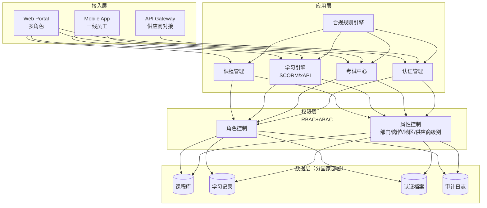

# 案例：世界500强企业培训与认证平台

> 覆盖16万+员工、5个国家/地区的跨国企业培训系统从0到1建设实践。

---

## 背景

**场景**：某世界500强消费电子企业的供应商培训体系升级

该企业全球员工16万+，供应商网络数千家。产品质量问题频发追溯到"培训不到位"——同一门安全操作课程，不同国家讲的内容不同；关键岗位是否持证上岗，无法全球统一追溯。

**痛点**：
- 培训标准不统一：5个国家/地区各用各的教材
- 认证流程复杂：纸质证书+Excel台账，查询认证历史需跨部门协调
- 合规要求严格：中国等保三级、欧盟GDPR、美国SOC2
- 多语言多币种：课程需本地化为5种语言，成本涉及4种货币

**目标**：构建统一、可规模化交付的企业培训与认证平台，实现"同一标准、全球执行、合规兜底、全程追溯"。

---

## 系统设计

### 整体架构



```
┌─────────────────────────────────────────────────────────────┐
│                     企业培训与认证平台                         │
├─────────────┬─────────────┬─────────────┬───────────────────┤
│   管理员端   │   培训师端   │   学员端    │    审核员/合规端   │
│  课程发布    │  课程制作    │  课程学习    │   合规审查         │
│  权限分配    │  考试命题    │  在线考试    │   审计追溯         │
│  认证管理    │  学员跟进    │  证书查看    │   异常预警         │
│  数据报表    │  成绩评定    │  学习进度    │   合规报告         │
├─────────────┴─────────────┴─────────────┴───────────────────┤
│  核心流程：课程管理 → 学习引擎 → 考试中心 → 认证管理         │
├─────────────────────────────────────────────────────────────┤
│  合规规则引擎（中国/欧盟/美国/亚太动态加载） + RBAC+ABAC权限  │
├─────────────────────────────────────────────────────────────┤
│  数据层：中国节点(等保) │ 欧盟节点(GDPR) │ 美国节点(SOC2)     │
└─────────────────────────────────────────────────────────────┘
```

### 多角色权限矩阵

| 角色 | 课程管理 | 学员管理 | 考试评分 | 认证审核 | 数据报表 | 合规审计 |
|------|----------|----------|----------|----------|----------|----------|
| 系统管理员 | 全部 | 全部 | 查看 | 全部 | 全部 | 查看 |
| 培训师 | 自己的课程 | 负责范围内 | 自己命题的考试 | 无 | 自己课程数据 | 无 |
| 学员 | 学习 | 个人中心 | 参加考试 | 查看自己证书 | 个人记录 | 无 |
| 审核员 | 审核课程 | 无 | 抽查 | 全部 | 汇总报表 | 发起审计 |
| 外部供应商 | 学习指定课程 | 自己企业学员 | 参加考试 | 查看自己证书 | 自己企业数据 | 无 |

### 核心流程

```
课程发布 → 学员学习 → 在线考试 → 认证颁发 → 全链追溯
            (进度跟踪)  (防作弊)   (数字签名)  (审计日志)
```

---

## 关键复杂度

### 挑战1：多国家合规——同一平台，五套规则

| 方案 | 优点 | 缺点 | 结论 |
|------|------|------|------|
| 各国独立部署 | 完全合规隔离 | 5套系统，维护成本高 | ❌ 放弃 |
| 一套系统+合规规则引擎 | 统一维护，动态加载 | 引擎设计复杂 | ✅ 选择 |

**解决**：**合规规则引擎（Compliance Rule Engine）**，按国家/地区动态加载策略。

- **数据存储路由**：中国用户→中国节点，欧盟用户→欧盟节点（满足GDPR数据跨境限制）
- **字段级脱敏**：同一张"员工信息表"，欧盟不返回身份证号（最小必要原则）
- **审批流程编排**：中国课程上线需3级审批，美国只需2级，引擎自动选择模板

### 挑战2：16万员工的权限管理——RBAC不够细

RBAC只能回答"你是不是管理员"，但企业需要"你是A部门资深工程师、在B工厂、负责C供应商级别，你能看到什么"。

**解决**：**RBAC + ABAC（属性权限控制）**，按**部门/岗位/地区/供应商级别**四维权限。

```
权限判定 = RBAC(角色) × ABAC(属性条件)

示例策略：
"只有[生产部门]的[主管级以上]员工，
 在[中国/美国]地区，供应商级别为[核心/优选]的，
 才能查看该供应商的安全培训证书"
```

性能优化：ABAC查询用**策略缓存+Bitmap预计算**，单次鉴权<5ms（经验值）。

### 挑战3：认证追溯与责任闭环

产品出问题时，质量部门需追溯"谁培训的、什么时候、培训内容是什么"。

**解决**：**全链路审计日志**，认证与员工/产品绑定。

```
审计日志（不可篡改）：
┌──────────────────────────────────────┐
│ 员工ID + 课程ID + 培训师ID            │
│ 学习时间 + 考核成绩 + 认证ID           │
│ 数字签名 + 区块链存证                 │
└──────────────────────────────────────┘
```

追溯查询：输入产品批次 → 产线 → 班组 → 人员 → 培训记录 → 认证状态，响应<2秒。

---

## 踩坑记录

### 坑1：时区处理——"我这边还是23点为什么显示已截止"

**问题**：UTC 0点截止考试，墨西哥员工当地时间前一天18点就无法进入，投诉"我这边还是23号"。

**解决**：
- 存储层：坚持UTC存储（唯一正确选择）
- 展示层：前端按用户浏览器时区渲染，带时区标识（如"23:59 CST"）
- 提醒层：按用户本地时区，截止前24h、1h分两次提醒
- 兜底：时区不确定的用户默认按企业注册地，允许手动切换

### 坑2：多语言不是简单翻译——法规引用变成了"天文符号"

**问题**：英文课程直接翻译中文内容，中国法规《安全生产法》第38条，美国员工看不懂。

**解决**：
- 课程内容拆分为"通用知识"+"本地法规"两个模块
- 法规用占位符`{{local_regulation:SAFETY_001}}`替代硬编码
- 按国家动态替换：中国→《安全生产法》，美国→OSHA 29 CFR，欧盟→Directive 89/656/EEC
- 后续教训：连"案例图片"也需本地化——中文标识的工厂图片让外国员工产生认知隔阂

### 坑3：认证过期提醒——"一刀切"引发客服瘫痪

**问题**：V1版本统一提前7天邮件提醒16万人，IT工单暴增3000+条，客服瘫痪。

**解决**：按岗位关键程度分级——关键岗位（生产/质检）过期前30/14/7/1天四级提醒；普通岗位过期前7天提醒。关键岗位过期立即锁定权限，普通岗位宽限30天。

---

## 量化成果

| 指标 | 数据 |
|------|------|
| 覆盖国家/地区 | 5个 |
| 员工数 | 16万+ |
| 累计认证人次 | 8.3万 |
| 关键岗位培训覆盖率 | 47% → 89% |
| 认证通过率 | 72% → 91%（标准化培训后） |
| 认证追溯查询响应 | <2秒 |
| 合规审计一次通过率 | 62% → 96% |

---

## 经验总结

1. **企业级系统的核心不是功能多，而是边界清晰**——每个模块的输入/输出/权限边界必须定义清楚，跨国系统"不能做什么"比"功能列表"更重要。

2. **多国家合规要前置设计，不能后期补丁**——数据存储架构一旦定型，后期改数据不出境的成本极高。合规规则引擎约占整体开发量15%，但省去后期80%的合规风险。

3. **权限设计要预留扩展性（RBAC→ABAC）**——16万员工×多维度属性，硬编码角色会爆炸。ABAC策略表达式让业务团队自行配置权限规则，无需开发介入。

---

## 可复用的方法论

```
跨国培训平台 = 统一课程引擎 + 合规规则引擎（按国家动态加载）
              + RBAC/ABAC混合权限 + 全链路审计日志
              + UTC时区处理规范 + 内容/法规分离架构
```

---

## 相关阅读

- [AI产品评估框架](../docs/AI产品评估框架.md) — 7维度评估
- [人机协同设计模式](../docs/人机协同设计模式.md) — 审核流程中的人机协同
- [RAG应用设计Checklist](../docs/RAG设计清单.md) — 智能培训助手的技术实现
