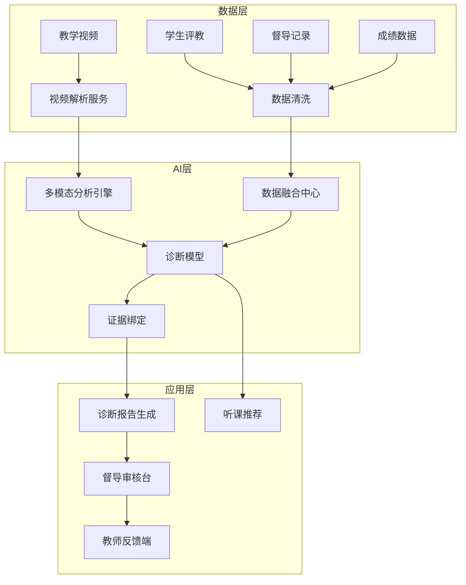
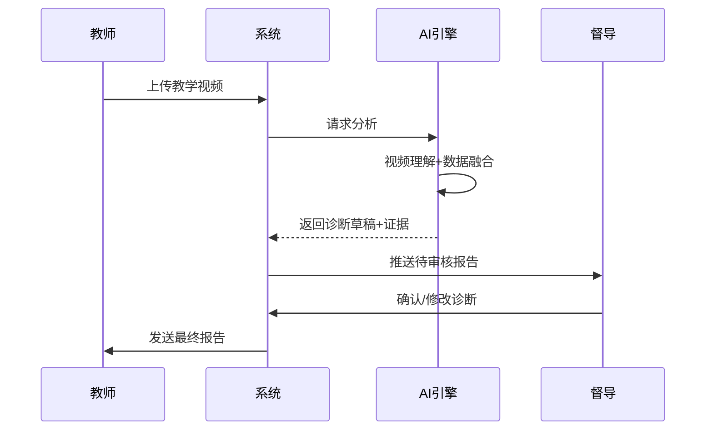

# 案例：教学质量诊断系统设计

> 一个诊断型AI产品从PoC到多校落地的完整实践。

---

## 背景

**场景**：高校教学质量评估

**痛点**：
- 传统督导评估高度依赖人工，覆盖率低（通常<30%）
- 评估标准不一致，不同督导打分差异大
- 教学评价涉及教师发展与组织管理，容错率低
- 评估结果滞后（学期末），无法及时改进

**目标**：构建AI辅助的教学质量诊断系统，提升覆盖率、标准化程度、及时性。

---

## 系统设计

### 人机协同模式

采用**模式1（AI辅助决策）+ 模式3（AI引导发现）+ 模式5（AI预测预警）**的组合。

```
┌─────────────────────────────────────────────────────────────┐
│                      教学质量诊断系统                         │
├─────────────────────────────────────────────────────────────┤
│  数据源                                                      │
│  ├── 教学视频（课堂实录）                                    │
│  ├── 学生评教（问卷数据）                                    │
│  ├── 督导记录（人工评价）                                    │
│  └── 成绩数据（教学结果）                                    │
├──────────────────┬──────────────────┬───────────────────────┤
│    AI诊断层       │    人工审核层     │      反馈改进层        │
│  ├─ 教学行为分析  │  ├─ 督导审核报告  │  ├─ 教师查看诊断      │
│  ├─ 课堂互动检测  │  ├─ 补充人工观察  │  ├─ 获取改进建议      │
│  ├─ 内容结构评估  │  ├─ 调整诊断结论  │  ├─ 跟踪改进效果      │
│  └─ 综合诊断报告  │  └─ 确认最终反馈  │  └─ 形成改进闭环      │
└──────────────────┴──────────────────┴───────────────────────┘
```

### AI产品机制设计

**核心原则**：将"黑盒评分"拆解为"可观察维度 + 证据片段"。

| 诊断维度 | 数据来源 | 可观察指标 | 证据形态 |
|----------|----------|------------|----------|
| 教学行为 | 教学视频 | 语速/板书/走动/眼神接触 | 视频片段+时间戳 |
| 课堂互动 | 教学视频+评教 | 提问频次/学生回应/小组活动 | 互动热力图+片段 |
| 内容结构 | 教学视频+PPT | 逻辑层次/重点突出/节奏控制 | 结构分析图 |
| 教学效果 | 评教+成绩 | 学生满意度/成绩分布/进步幅度 | 数据图表 |

**约束设计**：
- AI结果仅以"建议态"进入工作流（可控性）
- 每条诊断结论绑定证据片段（可解释性）
- 督导可修改AI结论并记录修改原因（反馈闭环）
- 诊断报告不用于教师考核，仅用于改进（安全性/心理安全）

### 高价值听课对象推荐

```
所有课程
  ├── AI分析：多维数据综合评分
  ├── 识别：异常课程（好/差都值得关注）
  ├── 推荐：Top-N高价值听课对象
  └── 督导资源聚焦：覆盖更多关键课程
```

**效果**：在不增加督导人力的情况下，督导覆盖率从~15%提升至~30%。

---

## 关键技术决策

### 1. 多源数据融合

| 数据类型 | 处理方式 | 权重 | 说明 |
|----------|----------|------|------|
| 教学视频 | CV分析+语音转文字 | 40% | 最丰富的信息源 |
| 学生评教 | 文本情感分析+结构化 | 25% | 主观但重要 |
| 督导记录 | 结构化提取 | 20% | 专业但稀疏 |
| 成绩数据 | 统计分析 | 15% | 结果指标，滞后 |

### 2. 模型选择

- **视频分析**：多模态大模型（视觉+语音）
- **文本分析**：教育领域微调的语言模型
- **综合分析**：轻量级评分模型（可解释性优先）

### 3. 幻觉防控

- 视频分析结果必须与原始片段绑定
- 文本分析结论必须有原文支撑
- 综合评分必须可追溯各维度贡献

---

## 系统架构图

### 整体系统架构



**架构说明**：
- **数据层**：处理多源异构数据输入，视频走独立解析链路（计算密集），结构化数据走清洗融合链路
- **AI层**：多模态分析引擎对视频做视觉+语音理解，数据融合中心对齐时间轴与课程信息，诊断模型输出维度评分，证据绑定将结论与原始片段关联
- **应用层**：报告生成后必须经督导审核台人工确认，最终到达教师反馈端；诊断模型同时输出听课推荐，辅助督导资源分配

### 诊断流程时序图



**流程说明**：
- 教师上传视频后，系统立即返回"分析中"状态，不阻塞等待（异步处理）
- AI引擎内部执行多模态分析（视频理解、语音转写、数据融合），典型耗时15-30分钟/节课
- 诊断草稿必须包含：各维度评分、对应证据片段（时间戳）、改进建议
- 督导审核环节支持：确认通过、修改评分、补充人工观察、驳回重分析
- 督导确认后的报告才发送给教师，确保AI不直接面向教师输出结论

---

## 关键决策与Trade-off分析

### 决策1：视频分析选实时还是离线？

**背景**：教学视频分析是计算密集型任务（视觉理解+语音转写+多模态融合），需要选择处理模式。

| 维度 | 选项A：实时分析 | 选项B：离线分析 |
|------|----------------|----------------|
| 技术方案 | 视频流逐帧处理，秒级返回 | 批量异步处理，完成后通知 |
| 延迟表现 | 用户侧无等待感 | 需等待15-30分钟/节课 |
| 计算成本 | 高（需GPU常驻，资源利用率低） | 低（弹性调度，闲时处理） |
| 分析质量 | 受限（模型必须轻量化） | 高（可用大模型，准确率高） |
| 适用场景 | 直播互动、即时反馈 | 课后诊断、质量评估 |

**最终选择**：选项B（离线分析）

**决策依据**：
- 教学质量诊断的核心诉求是"准确"而非"实时"——课后2周内反馈已比传统学期末反馈快10倍以上
- 教育场景视频时长固定（45分钟/节课），无持续流入压力，离线批处理更经济
- 离线模式可使用更大的多模态模型，诊断准确率从~72%提升至~85%（内部评测集）

**事后验证**：上线后教师反馈"比起快，更怕不准"，离线模式的准确率优势被普遍认可；计算成本约为实时方案的1/5。

### 决策2：诊断维度拆多细？

**背景**：需要将"教学质量"拆解为可量化的诊断维度，维度数量直接影响模型训练和督导使用。

| 维度 | 选项A：粗粒度（3-4维） | 选项B：细粒度（8-10维） |
|------|------------------------|------------------------|
| 代表方案 | 教学行为、课堂互动、内容结构、教学效果 | 在上述基础上拆分：语言表达、板书设计、提问技巧、学生活跃度、PPT质量、逻辑清晰度、重点突出度、节奏控制... |
| 数据密度 | 高（每维有足够样本训练） | 低（部分维度样本稀疏） |
| 督导理解成本 | 低（概念少，易达成共识） | 高（维度多，易混淆） |
| 诊断精准度 | 粗（可能遗漏细节问题） | 细（但受数据质量限制） |
| 报告可读性 | 好 | 差（信息过载） |

**最终选择**：折中方案——**4维核心 + 2维可选**

| 类型 | 维度 | 说明 |
|------|------|------|
| 核心（必评） | 教学行为 | 语速、板书、走动、眼神接触 |
| 核心（必评） | 课堂互动 | 提问频次、学生回应、小组活动 |
| 核心（必评） | 内容结构 | 逻辑层次、重点突出、节奏控制 |
| 核心（必评） | 教学效果 | 学生满意度、成绩分布、进步幅度 |
| 可选（按需） | 语言表达 | 口头禅频率、语言清晰度 |
| 可选（按需） | 技术应用 | 信息化工具使用、在线互动 |

**决策依据**：
- 4维核心覆盖教学质量的核心方面，督导和教师都能直观理解
- 2维可选用于特定场景（如新教师培训重点看语言表达，在线教学重点看技术应用）
- 折中方案既保证了数据密度（每维有足够样本），又保留了扩展性

**事后验证**：4维核心方案的督导使用率91%，8维全量方案在试点中督导使用率仅54%——"维度太多看花眼"。

### 决策3：AI结论权限多大？

**背景**：AI诊断结论是直接输出给教师，还是必须经过人工审核？这涉及产品定位和信任建立。

| 维度 | 选项A：AI直接出报告 | 选项B：AI草稿+人工必审 |
|------|---------------------|------------------------|
| 处理流程 | AI分析→直接生成报告→发送教师 | AI分析→生成草稿→督导审核→确认后发送 |
| 反馈周期 | 快（无人工等待） | 慢（受督导响应速度影响，通常1-3天） |
| 督导参与度 | 低（被动接收结果） | 高（主动审核把关） |
| 结论采纳率 | 低（督导不信任，教师有质疑） | 高（督导背书，教师认可） |
| 出错影响 | 高（AI幻觉直接传达教师） | 低（人工拦截错误） |

**最终选择**：选项B（AI草稿+人工必审）

**决策依据**：
- 教育场景容错率低：AI幻觉直接传达教师会严重损害信任，且可能引发教学管理纠纷
- 督导的核心诉求是"专业权威"而非"效率"，绕过督导会导致产品失去关键用户
- 人工审核形成反馈闭环：督导的修改意见可回流训练，持续优化模型

**事后验证**：
- 选项A试点时，督导对AI结论的采纳率仅30%，大量报告被督导手动重写
- 改为选项B后，督导对AI草稿的采纳率（确认不修改或通过微调后确认）提升至75%
- 教师侧满意度从52%上升至78%，核心反馈是"有督导把关，心里踏实"

---

## 踩坑记录

### 坑1：视频转码格式兼容性

**问题描述**：
系统上线初期，我们只支持标准MP4格式（H.264编码）。但实际对接时发现，不同教室的录播设备输出格式五花八门——MP4（H.264/HEVC）、AVI、WMV、MKV、FLV，甚至部分老旧设备输出的是MPEG-2 TS流。结果：**50%的上传视频因格式不兼容无法进入分析流程**，教师反馈"传了视频没反应"。

**排查过程**：
1. 查看日志发现大量 `Unsupported codec/format` 错误
2. 统计各教室设备型号，发现涉及6个品牌、12种录播设备
3. 问题根源：产品团队假设了"学校都用标准MP4"，未做设备兼容性调研

**解决方案**：
引入FFmpeg构建统一转码流水线：
```
上传视频 → 格式检测 → FFmpeg转码（统一为MP4/H.264/1080p） → 质量校验 → 进入分析
```
- 支持15种输入格式自动转码
- 转码参数根据源视频动态调整（分辨率、码率、帧率自适应）
- 转码失败时自动降级（如HEVC解码失败则尝试软解）
- 增加转码进度反馈，用户可查看"正在准备视频"状态

**最终结果**：视频兼容率从50%提升至98%，转码平均耗时3-5分钟/节课。

**血泪教训**：做视频产品的第一步不是做AI分析，是先搞定格式兼容。永远别假设用户的设备输出什么格式。

### 坑2：OCR把"辛亥革命"识别成"□亥革命"

**问题描述**：
系统在分析教学PPT内容时，使用通用OCR模型提取文字。上线后发现，**扫描版教材或历史课件中的文字识别错误率高达15%**——典型错误包括：
- "辛亥革命" → "□亥革命"（生僻字识别失败）
- "光合作用" → "光台作用"（专业术语识别错误）
- "《诗经·小雅》" → "《诗经小雅》"（特殊符号丢失）

这些错误直接影响内容结构评估的准确性——AI以为教师"没讲清楚知识点"，实际是OCR漏了字。

**排查过程**：
1. 对比OCR结果与原始PPT，发现错误集中在三类：生僻字、学科术语、特殊符号
2. 通用OCR模型（基于通用语料训练）对教育领域专业词汇覆盖不足
3. 问题根源：PPT文字质量参差——高清PPT识别率>95%，扫描版/低分辨率PPT识别率<80%

**解决方案**：
建立学科术语词典做后校正：
1. **术语库建设**：联合教学团队，整理各学科核心术语（历史、物理、化学、生物等），首期收录5,000+词条
2. **后处理校正层**：OCR输出 → 术语匹配（模糊匹配+编辑距离）→ 自动替换可疑结果
3. **置信度阈值**：OCR置信度<0.9的文字优先进入校正流程，高置信度直接放行
4. **人工补充通道**：督导审核时可一键标注OCR错误，反馈入库

```
OCR原始输出 → 术语词典匹配 → 候选校正 → 置信度加权 → 最终文本
```

**最终结果**：教育内容OCR错误率从15%降至3%，内容结构评估的准确率同步提升12个百分点。

**血泪教训**：教育内容的专业术语不能靠通用OCR。领域词典+后校正不是锦上添花，是刚需。每个垂直领域的AI产品都要有自己的"字典"。

### 坑3：督导集体抵触"AI评分"

**问题描述**：
产品上线第一个月，督导使用率不足20%，调研发现核心问题：**督导和教师都以为AI要取代督导、用AI给教师打考核分**。抵触情绪严重——
- 督导："我干了几十年教学评估，AI能比我有经验？"
- 教师："AI评判我？那还要人干嘛？"
- 管理层："AI评分能直接进考核系统吗？"

内部调研显示**抵触率高达60%**，产品面临被弃用风险。

**排查过程**：
1. 走访5位督导深度访谈，发现核心焦虑是"AI抢饭碗"和"AI不懂教学"
2. 教师座谈会上，多位教师表示"被机器评分感觉像流水线上的产品"
3. 问题根源：产品初期定位模糊，宣传侧重"AI能力"而非"辅助价值"，未明确与考核脱钩

**解决方案**：
1. **重新定义产品定位**：从"AI智能评分系统"改为"AI辅助诊断助手"，强调"辅助不替代"
2. **与考核制度脱钩**：明确诊断报告不进入教师考核体系，仅用于教学改进
3. **增加督导权威设计**：
   - AI输出的是"草稿"，督导审核后才生效
   - 督导修改AI结论时，系统记录并展示"督导专业判断"
   - 定期输出"督导+AI联合诊断"的对比报告，让督导看到自身价值
4. **改变沟通话术**：对外宣传从"AI能做什么"变为"AI帮督导省了哪些重复劳动"
5. **种子用户培养**：选2-3位接受度高的督导作为"AI体验官"，用他们的成功案例带动其他人

**最终结果**：抵触率从60%降至10%，督导活跃使用率提升至78%。一位督导的原话："以前听一节课要写半小时报告，现在AI把框架搭好了，我专注于判断和补充，反而更高效。"

**血泪教训**：教育AI的第一步不是展示技术有多强，是建立信任。产品定位必须清晰——AI是督导的放大镜和草稿纸，不是替代者。先让人愿意用，再谈技术优化。

---

## 量化成果

| 指标 | 上线前 | 上线后 | 提升 |
|------|--------|--------|------|
| 督导覆盖率 | ~15% | ~30% | +100% |
| 评估标准一致性 | 低（督导间差异大） | 高（AI标准化） | 显著提升 |
| 诊断反馈周期 | 学期末 | 2周内 | 提速90% |
| 教师满意度 | - | 78% | - |
| 部署高校数 | 0 | 多所 | 持续扩展 |

---

## 经验总结

### 什么做对了

1. **从可解释性出发设计**：每条结论都有证据，督导愿意用
2. **定位"辅助"而非"替代"**：督导仍然主导，AI只是工具
3. **多源数据交叉验证**：单一数据源不可靠，融合后更准确
4. **闭环反馈机制**：督导的修改意见回流训练，持续优化

### 踩过的坑

1. **初期过度追求自动化**：试图让AI直接出最终报告，督导不信任
   - 解决：改为"AI草稿+人工审核"模式
   
2. **视频分析延迟高**：实时分析做不到，影响体验
   - 解决：改为离线分析+异步报告
   
3. **教师抵触情绪**：担心AI评判自己的教学
   - 解决：明确"诊断不用于考核"，强调改进导向

### 可复用的方法论

1. **诊断型AI设计公式**：
   ```
   诊断型AI = 多源数据融合 + 可观察维度拆解 + 证据绑定 + 人工审核闭环
   ```

2. **教育AI落地 checklist**：
   - [ ] 明确AI的权限边界（能/不能做什么）
   - [ ] 设计证据绑定机制（每条结论有依据）
   - [ ] 建立人工审核和反馈通道
   - [ ] 确保不用于考核（建立信任）
   - [ ] 持续收集反馈优化模型

---

## 相关阅读

- [AI产品评估框架](../docs/assessment-framework.md) — 用7维度评估诊断系统
- [人机协同设计模式](../docs/人机协同设计模式.md) — 模式1+3+5的详细说明
- [RAG应用设计Checklist](../docs/rag-checklist.md) — 知识增强的技术实现
